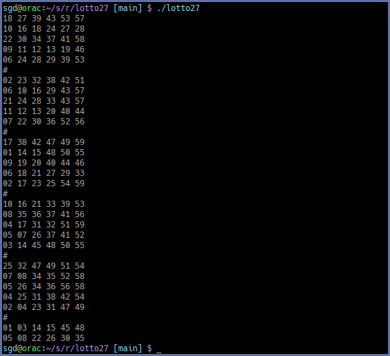

# Introduction

This is some code to generate a random 27 rows of lottery tickets for the UK national lottery that will guarantee a match of two balls.

**This will not increase your wealth in any way.**

[Inspired by the Matt Parker video: ](https://www.youtube.com/watch?v=zYkmIxS4ksA)

[Original paper by David Cushing and David I. Stewart ](https://arxiv.org/pdf/2307.12430.pdf)

# Sample output

